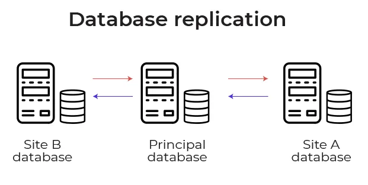
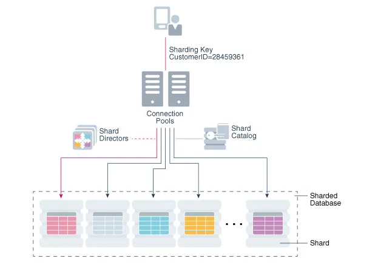
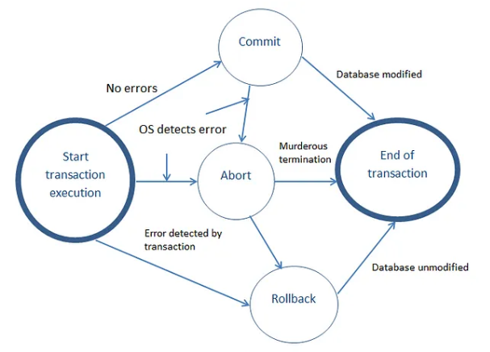

#### A system should be Reliable, Scalable, Maintainable
- **Reliable**: means the system should be fault-tolerant and working when faults/error happen.
- **Scalable**: means should be able to cater to the growing users, traffic and data
- **Maintainable**: even after adding new functionalities and features as per the new requirements, the system and the existing code should work.


#### Load and Load Estimation
The most important three:
- **Throughput** — It's measured by no of jobs processed/ second
- **Response time** — It's measured by the time between sending request and getting a response
- **Latency** — It's measured by the time it takes for a request waiting in the queue to be completed.

```python
import time

class JobProcessor:
    def __init__(self):
        self.queue = []
        self.processed_jobs = 0

    def add_job(self):
        self.queue.append(time.time())

    def process_job(self):
        if self.queue:
            start_time = self.queue.pop(0)
            end_time = time.time()
            response_time = end_time - start_time
            latency = end_time - start_time
            self.processed_jobs += 1
            return response_time, latency
        else:
            return None, None

    def get_throughput(self, elapsed_time):
        return self.processed_jobs / elapsed_time

# Usage example
job_processor = JobProcessor()

# Simulate job arrivals
for _ in range(10):
    job_processor.add_job()
    time.sleep(0.1)

# Process jobs and measure response time and latency
while True:
    response_time, latency = job_processor.process_job()
    if response_time is None:
        break
    print(f"Response Time: {response_time:.3f}s, Latency: {latency:.3f}s")
    time.sleep(0.1)

elapsed_time = time.time()
throughput = job_processor.get_throughput(elapsed_time)
print(f"Throughput: {throughput:.2f} jobs/second")
```

#### NoSQL, SQL and Graph Databases
- **Relational Databases** — It consists of tables ( data organized in rows and columns). It uses joins to fetch data from multiple tables.
- **Non-Relational Databases ( NoSQL databases)** — It consists of keys that are mapped to the values. It’s easier to shard a NoSQL database and works without formatting the data. Some examples of NoSQL databases include MongoDB, Cassandra, and Redis.
```python
from pymongo import MongoClient

# Connect to MongoDB
client = MongoClient('mongodb://localhost:27017/')
db = client['mydatabase']

# Insert document into collection
collection = db['mycollection']
document = {'name': 'John', 'age': 30}
collection.insert_one(document)

# Query documents from collection
results = collection.find({'age': {'$gt': 25}})
for result in results:
    print(result)
```
- **Key-Value Stores** — It consists of keys that are mapped to the values. It’s easier to shard a NoSQL database and works without formatting the data.
```python
# Using Redis as a key-value store
import redis

# Connect to Redis
r = redis.Redis(host='localhost', port=6379, db=0)

# Set a key-value pair
r.set('key', 'value')

# Get the value for a key
value = r.get('key')
print(value.decode())

# Delete a key
r.delete('key')
```
- **Document Stores** — is a type of NoSQL database that stores data as documents, where each document contains multiple fields.
```python
# Using MongoDB as a document store
from pymongo import MongoClient

# Connect to MongoDB
client = MongoClient('mongodb://localhost:27017/')
db = client['mydatabase']

# Insert a document
doc = {"name": "John", "age": 30}
db.mycollection.insert_one(doc)

# Find documents
results = db.mycollection.find({"age": {"$gt": 25}})
for result in results:
    print(result)

# Update a document
db.mycollection.update_one({"name": "John"}, {"$set": {"age": 31}})

# Delete a document
db.mycollection.delete_one({"name": "John"})
```

- **Column-Family Stores** — It consists of columns that are grouped together to form a column family. It is used to store large amounts of data.
```python
# Using Apache Cassandra as a wide column store
from cassandra.cluster import Cluster

# Connect to Cassandra
cluster = Cluster(['127.0.0.1'])
session = cluster.connect('mykeyspace')

# Create a table
session.execute("""
    CREATE TABLE mytable (
        id UUID PRIMARY KEY,
        name TEXT,
        age INT
    )
""")

# Insert data
session.execute("""
    INSERT INTO mytable (id, name, age) VALUES (%s, %s, %s)
""", (uuid.uuid4(), "John", 30))

# Query data
result = session.execute("SELECT * FROM mytable WHERE age > 25")
for row in result:
    print(row)

# Update data
session.execute("UPDATE mytable SET age = 31 WHERE name = 'John'")

# Delete data
session.execute("DELETE FROM mytable WHERE name = 'John'")
```

- **Graph Databases** — It consists of graph( vertices and edges) and the queries traverse the graph in order to provide the results.


```python
from py2neo import Graph, Node, Relationship

# Connect to the graph database
graph = Graph("bolt://localhost:7687", auth=("username", "password"))

# Create nodes
node1 = Node("Person", name="Alice")
node2 = Node("Person", name="Bob")

# Create a relationship between the nodes
relationship = Relationship(node1, "FRIENDS_WITH", node2)

# Create or update the graph database
graph.merge(node1, "Person", "name")
graph.merge(node2, "Person", "name")
graph.merge(relationship)
```

#### Indexes
Indexes are very useful as they help speed up the query execution and helps faster retrieval of the data.

Syntax:
```sql
CREATE INDEX index_name ON table_namme (column_1, column_2, ...column_n);
```
There are two types of indexes —

- Implicit indexes — indexes that are created by databases internally to store, retrieve faster and efficiently.
- Composite indexes — indexes that are created by using multiple columns to uniquely identify the data points.

```sql
-- Syntax
CREATE UNIQUE INDEX index_name ON table_name (column1, column2, ...);
-- Example
CREATE INDEX emp_indx ON employee(emp_name, salary, city);
-- Drop index
ALTER TABLE table DROP INDEX index_name;
```

#### Data Warehousing


- **Row-oriented storage** — Most transactional databases use row oriented storage. The database is partitioned horizontally and with this approach writes are performed easily as compared to reads. Examples — PostgresSQL, MySQL and SQL Server.
```sql
-- Create a table for row-oriented storage
CREATE TABLE row_storage (
    id INT,
    name VARCHAR(50),
    age INT,
    email VARCHAR(100)
);
```
- **Column-oriented storage** — In this every value is stored in the columns contiguously. The database is partitioned vertically and with this approach reads are performed easily as compared to writes. Examples — Redshift, BigQuery and Snowflake.
```sql
-- Create a table for column-oriented storage
CREATE TABLE column_storage (
    id INT[],
    name VARCHAR(50)[],
    age INT[],
    email VARCHAR(100)[]
);
```

- **Data Cube** — It is a process of collecting, storing and managing data from different sources to provide meaningful insights. It is used for reporting and analysis of data.


#### Serialization and Deserialization


```python
import pickle

# Define an object
data = {
    'name': 'John Doe',
    'age': 30,
    'email': 'johndoe@example.com'
}

# Serialization: Convert the object to a byte stream
serialized_data = pickle.dumps(data)

# Save the serialized data to a file
with open('serialized_data.pkl', 'wb') as file:
    file.write(serialized_data)

# Deserialization: Convert the byte stream back to an object
with open('serialized_data.pkl', 'rb') as file:
    deserialized_data = pickle.load(file)

# Print the deserialized data
print(deserialized_data)
```

#### Replication


```python
import sqlite3

# Connect to the primary database
primary_conn = sqlite3.connect('primary.db')
primary_cursor = primary_conn.cursor()

# Connect to the replica database
replica_conn = sqlite3.connect('replica.db')
replica_cursor = replica_conn.cursor()

# Retrieve data from primary and replicate to the replica
primary_cursor.execute("SELECT * FROM my_table")
data = primary_cursor.fetchall()
replica_cursor.executemany("INSERT INTO my_table VALUES (?, ?, ?)", data)

# Commit the changes
replica_conn.commit()

# Close the connections
primary_conn.close()
replica_conn.close()
```

- **Master-Slave Replication** — is a method of replicating data in which multiple servers (the masters) can accept writes and propagate them to other servers. This method is useful for write-heavy workloads, as it allows for distributed writes to multiple servers.
```python
# Example of master-slave replication using a database library like SQLAlchemy
from sqlalchemy import create_engine
from sqlalchemy.orm import sessionmaker

# Master database
master_engine = create_engine('master_database_url')
MasterSession = sessionmaker(bind=master_engine)

# Slave databases
slave1_engine = create_engine('slave1_database_url')
Slave1Session = sessionmaker(bind=slave1_engine)

slave2_engine = create_engine('slave2_database_url')
Slave2Session = sessionmaker(bind=slave2_engine)

# Usage example
master_session = MasterSession()
slave1_session = Slave1Session()
slave2_session = Slave2Session()

# Read from slaves
users = slave1_session.query(User).all()

# Write to master
new_user = User(name='John', age=30)
master_session.add(new_user)
master_session.commit()
```
- **Master-Master Replication** — In this, both databases can handle write operations and read operations. This can be useful for load balancing and high availability.
```python
# Example of master-master replication using a database library like SQLAlchemy
from sqlalchemy import create_engine
from sqlalchemy.orm import sessionmaker

# Master databases
master1_engine = create_engine('master1_database_url')
Master1Session = sessionmaker(bind=master1_engine)

master2_engine = create_engine('master2_database_url')
Master2Session = sessionmaker(bind=master2_engine)

# Usage example
master1_session = Master1Session()
master2_session = Master2Session()

# Write to master 1
new_user1 = User(name='John', age=30)
master1_session.add(new_user1)
master1_session.commit()

# Write to master 2
new_user2 = User(name='Alice', age=25)
master2_session.add(new_user2)
master2_session.commit()

# Read from master 1
users_from_master1 = master1_session.query(User).all()

# Read from master 2
users_from_master2 = master2_session.query(User).all()
```
- **Fedaration** - is a method of distributing data across multiple servers by splitting a large table into smaller tables and distributing them across multiple servers. This method is useful for large datasets that cannot fit on a single server.
```python
# Example of data federation using a distributed storage system like Apache Cassandra

from cassandra.cluster import Cluster

# Connect to Cassandra cluster
cluster = Cluster(['node1', 'node2', 'node3'])
session = cluster.connect()

# Create keyspace and table on each node
session.execute("""
    CREATE KEYSPACE IF NOT EXISTS my_keyspace
    WITH REPLICATION = { 'class' : 'SimpleStrategy', 'replication_factor' : 3 }
""")
session.execute("""
    CREATE TABLE IF NOT EXISTS my_keyspace.users (
        id UUID PRIMARY KEY,
        name TEXT,
        age INT
    )
""")

# Insert data into federated tables
session.execute("""
    INSERT INTO my_keyspace.users (id, name, age)
    VALUES (uuid(), 'John', 30)
""")
session.execute("""
    INSERT INTO my_keyspace.users (id, name, age)
    VALUES (uuid(), 'Alice', 25)
""")

# Query data from federated tables
rows = session.execute("""
    SELECT * FROM my_keyspace.users
""")
for row in rows:
    print(row.id, row.name, row.age)
```

#### Partitioning/Sharding
```python
import psycopg2

# Connect to the database
conn = psycopg2.connect(database="mydb", user="myuser", password="mypassword", host="localhost", port="5432")
cursor = conn.cursor()

# Create a table with horizontal partitioning
cursor.execute("CREATE TABLE my_table (id SERIAL, name VARCHAR(50)) PARTITION BY RANGE (id)")

# Create partitions
cursor.execute("CREATE TABLE my_table_1 PARTITION OF my_table FOR VALUES FROM (1) TO (100)")
cursor.execute("CREATE TABLE my_table_2 PARTITION OF my_table FOR VALUES FROM (101) TO (200)")
cursor.execute("CREATE TABLE my_table_3 PARTITION OF my_table FOR VALUES FROM (201) TO (300)")

# Shard the data
cursor.execute("INSERT INTO my_table_1 (name) VALUES ('John')")
cursor.execute("INSERT INTO my_table_2 (name) VALUES ('Jane')")
cursor.execute("INSERT INTO my_table_3 (name) VALUES ('Mark')")

# Commit the changes
conn.commit()

# Close the connection
conn.close()
```
**Horizontal Sharding** — divide the database table’s rows into multiple different tables where each part has the same schema and columns but different rows in order to create unique and independent partitions.



```python
import psycopg2

# Connect to the shard databases
shard1_conn = psycopg2.connect(database="shard1", user="myuser", password="mypassword", host="localhost", port="5432")
shard1_cursor = shard1_conn.cursor()

shard2_conn = psycopg2.connect(database="shard2", user="myuser", password="mypassword", host="localhost", port="5432")
shard2_cursor = shard2_conn.cursor()

# Insert data into the respective shard based on the sharding logic
def insert_data(id, name):
    if id % 2 == 0:
        shard1_cursor.execute("INSERT INTO my_table (id, name) VALUES (%s, %s)", (id, name))
        shard1_conn.commit()
    else:
        shard2_cursor.execute("INSERT INTO my_table (id, name) VALUES (%s, %s)", (id, name))
        shard2_conn.commit()

# Insert data using the sharding function
insert_data(1, "John")
insert_data(2, "Jane")
insert_data(3, "Mark")

# Close the connections
shard1_conn.close()
shard2_conn.close()
```

**Vertical Sharding** — divide the database entire columns into new distinct tables such that each vertically partitioned parts are independent of all the others and have distinct rows and columns.

```python
import psycopg2

# Connect to the database
conn = psycopg2.connect(database="mydb", user="myuser", password="mypassword", host="localhost", port="5432")
cursor = conn.cursor()

# Create the main table
cursor.execute("CREATE TABLE my_table (id SERIAL, name VARCHAR(50), address TEXT)")

# Create vertical shards
cursor.execute("CREATE TABLE my_table_frequent (id SERIAL, name VARCHAR(50))")
cursor.execute("CREATE TABLE my_table_infrequent (id SERIAL, address TEXT)")

# Shard the data
cursor.execute("INSERT INTO my_table_frequent (name) VALUES ('John')")
cursor.execute("INSERT INTO my_table_infrequent (address) VALUES ('123 Main St')")

# Commit the changes
conn.commit()

# Close the connection
conn.close()
```

#### Transactions



```python
import psycopg2

# Connect to the database
conn = psycopg2.connect(database="mydb", user="myuser", password="mypassword", host="localhost", port="5432")
cursor = conn.cursor()

try:
    # Begin the transaction
    conn.autocommit = False
    cursor.execute("BEGIN")

    # Execute multiple SQL statements as part of the transaction
    cursor.execute("INSERT INTO employees (id, name) VALUES (1, 'John')")
    cursor.execute("UPDATE employees SET name = 'Jane' WHERE id = 1")

    # Commit the transaction
    conn.commit()
    print("Transaction committed successfully!")

except psycopg2.DatabaseError as error:
    # Rollback the transaction in case of any error
    conn.rollback()
    print(f"Transaction rolled back due to error: {error}")

finally:
    # Restore the autocommit mode and close the connection
    conn.autocommit = True
    conn.close()
```

ACID means —

- **Atomicity** — It means either all the operations of a transaction are properly reflected in the database or none of them.
- **Consistency**- It means the execution of a transaction should be isolated so that data consistency be maintained.
- **Isolation** — It means, in the situations where multiple transactions are executing, each transaction should be unaware of the other executing transaction and should be isolated.
- **Durability**- It means after the transaction is complete, the changes that are made to the database should persists even in case of system failures.

**Linearizability**: Linearizability is a consistency model for distributed systems. It ensures that all operations on a shared resource appear to take place atomically and in the order in which they were requested. This means that if multiple operations are performed concurrently, they will appear to occur in a single, linear order.
```python
import threading

class Counter:
    def __init__(self):
        self.value = 0

    def increment(self):
        self.value += 1

counter = Counter()

def increment_counter():
    for _ in range(1000):
        counter.increment()

# Create multiple threads to increment the counter concurrently
threads = []
for _ in range(10):
    thread = threading.Thread(target=increment_counter)
    threads.append(thread)
    thread.start()

# Wait for all threads to complete
for thread in threads:
    thread.join()

print("Counter value:", counter.value)
```

**Ordering**: Ordering refers to the way in which operations are performed in a distributed system. It can refer to the order in which operations are performed on a shared resource, or the order in which events are delivered to different nodes in the system.

```python
from collections import deque

queue = deque()

def process_event(event):
    queue.append(event)

def consume_events():
    while queue:
        event = queue.popleft()
        print("Processing event:", event)

process_event("Event 1")
process_event("Event 2")
consume_events()
```

**Clocks**: In distributed systems, clocks are used to synchronize events across different nodes.
```python
import time

start_time = time.time()

def get_elapsed_time():
    return time.time() - start_time

print("Elapsed time:", get_elapsed_time())
```

**Consensus**: Consensus is the process of achieving agreement among the nodes in a distributed system. This typically involves agreeing on the value of a shared resource or the order of operations to be performed. Different algorithms and protocols exist to achieve consensus in distributed systems.

```python 
def vote(votes):
    return max(set(votes), key=votes.count)

votes = ['Option A', 'Option B', 'Option A', 'Option C', 'Option B']
consensus = vote(votes)
print("Consensus:", consensus)
```

**DNS (Domain Name System)** is a system that maps domain names (such as www.google.com) to IP addresses.
```python
import socket

ip_address = socket.gethostbyname('www.google.com')
print("IP address:", ip_address)
```

**CDN (Content Delivery Network)** is a network of servers that are distributed around the world to provide faster access to content by delivering it from a server that is geographically closer to the user. There are two types of CDNs: push CDNs and pull CDNs.

**TCP (Transmission Control Protocol)** is a transport layer protocol that provides a reliable, stream-oriented connection between two devices. It guarantees that data is delivered in the order in which it was sent and that lost packets are retransmitted.

```python
import socket

# TCP client
client_socket = socket.socket(socket.AF_INET, socket.SOCK_STREAM)
client_socket.connect(("localhost", 8080))

# Send data to the server
client_socket.sendall(b"Hello, server!")

# Receive data from the server
data = client_socket.recv(1024)
print("Received:", data.decode())

# Close the connection
client_socket.close()
```

**UDP (User Datagram Protocol)** is another transport layer protocol that is connectionless and does not guarantee delivery or order of packets. It is faster than TCP but less reliable.

```python
import socket

# UDP client
client_socket = socket.socket(socket.AF_INET, socket.SOCK_DGRAM)

# Send data to the server
client_socket.sendto(b"Hello, server!", ("localhost", 8080))

# Receive data from the server
data, server_address = client_socket.recvfrom(1024)
print("Received:", data.decode())

# Close the connection
client_socket.close()
```

**Read replicas** are copies of a database that can be used to offload read operations from the primary (or master) database. 

```python
import psycopg2

# Connect to the primary database
primary_conn = psycopg2.connect(database="primary_db", user="user", password="password", host="localhost", port="5432")

# Connect to a read replica database
replica_conn = psycopg2.connect(database="replica_db", user="user", password="password", host="localhost", port="5433")

# Perform read operations on the replica database
replica_cursor = replica_conn.cursor()
replica_cursor.execute("SELECT * FROM users")
rows = replica_cursor.fetchall()
for row in rows:
    print(row)

# Perform write operations on the primary database
primary_cursor = primary_conn.cursor()
primary_cursor.execute("INSERT INTO users (name, email) VALUES ('John Doe', 'john@example.com')")
primary_conn.commit()

# Close the connections
replica_cursor.close()
replica_conn.close()
primary_cursor.close()
primary_conn.close()
```

**Object Store**: is a type of data storage that stores data as “objects” (usually files) rather than as rows in a table.

```python
import boto3

# Create an S3 client
s3_client = boto3.client('s3')

# Upload an object to the object store
s3_client.upload_file('/path/to/local/file', 'my-bucket', 'object-key')

# Download an object from the object store
s3_client.download_file('my-bucket', 'object-key', '/path/to/local/file')

# Delete an object from the object store
s3_client.delete_object(Bucket='my-bucket', Key='object-key')
```

**Async API** is an API (Application Programming Interface) that allows the calling program to continue executing while the API processes the request.

```python
import asyncio

async def process_request(request):
    # Simulate processing time
    await asyncio.sleep(1)
    return "Processed: " + request

async def main():
    # Make async API requests
    requests = ["Request 1", "Request 2", "Request 3"]

    # Create tasks for each request
    tasks = [asyncio.create_task(process_request(request)) for request in requests]

    # Wait for all tasks to complete
    results = await asyncio.gather(*tasks)

    # Print the results
    for result in results:
        print(result)

# Run the main function
asyncio.run(main())
```

**Read API** allows clients to retrieve data from a server, while a **write API** allows clients to submit data to a server.

```python
# Read API
def get_data():
    # Retrieve data from a server
    # ...
    return data

data = get_data()
print("Retrieved data:", data)

# Write API
def submit_data(data):
    # Submit data to a server
    # ...
    return response

response = submit_data(data)
print("Server response:", response)
```

**Memory cache** is a type of cache that stores data in the memory of the server, allowing for faster access to frequently used data.

```python
from cachetools import LRUCache

# Create a memory cache with a maximum size of 100 items
cache = LRUCache(maxsize=100)

def get_data(key):
    # Check if the data is in the cache
    if key in cache:
        return cache[key]

    # Retrieve data from the server
    data = retrieve_data_from_server(key)

    # Store the data in the cache
    cache[key] = data

    return data

data = get_data("example_key")
print("Retrieved data:", data)
```
Cache is a mechanism used to temporarily store data in a faster access memory, such as RAM, to improve the performance of an application or system. There are several types of caching, including:

- **Client caching**: this is done by the client’s browser and stores frequently requested data on the client’s computer, reducing the number of requests to the server.
- **CDN caching**: this is done by a Content Delivery Network (CDN) and stores frequently requested data on servers located closer to the user, reducing the time required to retrieve data from the origin server.
- **Web server caching**: this is done by the web server and stores frequently requested data in memory, reducing the number of requests to the application or database.
- **Database caching**: this is done by the database management system and stores frequently requested data in memory, reducing the number of requests to the storage layer.
- **Application caching**: this is done by the application and stores frequently requested data in memory, reducing the number of requests to the database or other service.
- **Caching at the database query level**: this is done by the database management system and stores the results of frequently executed queries in memory, reducing the time required to retrieve data from the storage layer.
- **Caching at the object level**: this is done by the application and stores the results of frequently executed queries in memory, reducing the time required to retrieve data from the database or other service.

There are several strategies for updating the cache, including:

- **Cache-aside**: this strategy involves first checking the cache for the requested data, and if it is not found, retrieving it from the source and then storing it in the cache.
- **Write-through**: this strategy involves updating the cache and the source at the same time, ensuring that the cache is always up to date.
- **Write-behind (write-back)**: this strategy involves updating the cache and then updating the source at a later time, allowing multiple updates to be batched together for efficiency.
- **Refresh-ahead**: this strategy involves proactively updating the cache with new data before it is requested, ensuring that the most recent data is always available.

**Three Tier Caching**: A caching architecture that divides the cache into three levels, each with increasing size and longer latency. The first tier is typically a small, fast cache, while the third tier is a larger, slower cache.

```python
from functools import lru_cache

# First-tier cache (small, fast)
@lru_cache(maxsize=100)
def cache_tier1(key):
    # Fetch data from the source and return
    return fetch_data_from_source(key)

# Second-tier cache (medium size, medium latency)
@lru_cache(maxsize=1000)
def cache_tier2(key):
    # Check if data is in the first-tier cache
    data = cache_tier1(key)
    if data is not None:
        return data
    else:
        # Fetch data from the source and return
        return fetch_data_from_source(key)

# Third-tier cache (large, slow)
@lru_cache(maxsize=10000)
def cache_tier3(key):
    # Check if data is in the second-tier cache
    data = cache_tier2(key)
    if data is not None:
        return data
    else:
        # Fetch data from the source and return
        return fetch_data_from_source(key)
```

**Cache Stampede**: A phenomenon that occurs when a large number of cache misses occur simultaneously, leading to an excessive number of requests to a slow data source, such as a database.

```python
import threading

# Dictionary to store cached data
cache = {}
# Lock for cache access
cache_lock = threading.Lock()

def get_data(key):
    if key in cache:
        # Data found in cache
        return cache[key]
    else:
        with cache_lock:
            if key in cache:
                # Data found in cache (acquired by another thread)
                return cache[key]
            else:
                # Data not found in cache, fetch from the data source
                data = fetch_data_from_source(key)
                cache[key] = data
                return data
```

**Asynchronism** is a technique that allows a program to perform multiple tasks simultaneously, without waiting for one task to finish before starting the next. This can be achieved using message queues, task queues, and back pressure.

```python
import asyncio

async def task1():
    print("Task 1 started")
    await asyncio.sleep(1)
    print("Task 1 completed")

async def task2():
    print("Task 2 started")
    await asyncio.sleep(2)
    print("Task 2 completed")

async def main():
    await asyncio.gather(task1(), task2())

asyncio.run(main())
```

**SQL tuning** refers to the process of optimizing the performance of SQL (Structured Query Language) statements in a relational database management system (RDBMS). This can include identifying and addressing issues such as slow-running queries, resource contention, and poor indexing.

```python
import sqlite3

# Connect to the database
conn = sqlite3.connect('example.db')
c = conn.cursor()

# Create an index on the 'name' column of the 'users' table
c.execute("CREATE INDEX idx_name ON users (name)")

# Execute a query that can benefit from the index
c.execute("SELECT * FROM users WHERE name = 'John'")

# Fetch the results
results = c.fetchall()
print(results)

# Close the connection
conn.close()
```

techniques that can be used for SQL tuning:
- **Indexing**
- **Query optimization**
- **Partitioning**
- **Denormalization**: is a method of organizing data in a way that reduces the number of table joins required to retrieve data. This method can improve query performance, but can also make it more difficult to maintain data consistency.

**Message Brokers, Message Queues, and Publish-Subscribe** are all messaging patterns that are used to communicate between different parts of an application.
```python
import pika

# Publish
connection = pika.BlockingConnection(pika.ConnectionParameters('localhost'))
channel = connection.channel()
channel.queue_declare(queue='my_queue')
channel.basic_publish(exchange='', routing_key='my_queue', body='Hello, World!')
connection.close()

# Subscribe
def callback(ch, method, properties, body):
    print("Received:", body)

connection = pika.BlockingConnection(pika.ConnectionParameters('localhost'))
channel = connection.channel()
channel.queue_declare(queue='my_queue')
channel.basic_consume(queue='my_queue', on_message_callback=callback, auto_ack=True)
channel.start_consuming()
```

**Event-Driven Architecture (EDA)** is a pattern where the system reacts to events, rather than requests.
```python
# Event-Driven Architecture (EDA) example using a simple event dispatcher

class EventDispatcher:
    def __init__(self):
        self.listeners = {}

    def add_listener(self, event, listener):
        if event not in self.listeners:
            self.listeners[event] = []
        self.listeners[event].append(listener)

    def remove_listener(self, event, listener):
        if event in self.listeners:
            self.listeners[event].remove(listener)

    def dispatch_event(self, event, data):
        if event in self.listeners:
            for listener in self.listeners[event]:
                listener(data)

# Usage example
def event_handler(data):
    print(f"Event received: {data}")

dispatcher = EventDispatcher()
dispatcher.add_listener("event_name", event_handler)
dispatcher.dispatch_event("event_name", "Event data")
```
**Event Sourcing** is a pattern that stores all changes to an application’s state as a sequence of events.
```python
# Event Sourcing example using a simple event store

class Event:
    def __init__(self, event_type, data):
        self.event_type = event_type
        self.data = data

class EventStore:
    def __init__(self):
        self.events = []

    def store_event(self, event):
        self.events.append(event)

    def get_events(self):
        return self.events

# Usage example
event_store = EventStore()
event_store.store_event(Event("event_type", "Event data"))
events = event_store.get_events()
for event in events:
    print(f"Event type: {event.event_type}, Event data: {event.data}")
```

**CQRS (Command Query Responsibility Segregation)** is a pattern that separates the read and write operations of an application.
```python
# Command and Query Responsibility Segregation (CQRS) example using separate command and query handlers

class CommandHandler:
    def handle_command(self, command):
        print(f"Handling command: {command}")

class QueryHandler:
    def handle_query(self, query):
        print(f"Handling query: {query}")
        return "Query result"

# Usage example
command_handler = CommandHandler()
query_handler = QueryHandler()

command_handler.handle_command("Command")
result = query_handler.handle_query("Query")
print(f"Query result: {result}")
```

**API Gateway** is a pattern that acts as a reverse proxy and routing layer for API requests.
```python
# API Gateway example using Flask framework

from flask import Flask, request

app = Flask(__name__)

@app.route('/api/resource', methods=['GET', 'POST'])
def resource_handler():
    if request.method == 'GET':
        # Handle GET request
        return "GET response"
    elif request.method == 'POST':
        # Handle POST request
        return "POST response"

if __name__ == '__main__':
    app.run()
```

**Load balancer** is a device that distributes incoming network traffic across multiple servers. There are different types of load balancing: active-passive, active-active, layer 4 load balancing, layer 7 load balancing, horizontal scaling.
    
```python
import random

# List of server addresses
servers = ["server1.example.com", "server2.example.com", "server3.example.com"]

# Load balancing using random selection
selected_server = random.choice(servers)
print("Request sent to:", selected_server)
```

**REST, GraphQL, and gRPC** are different types of API architectures. REST is a common architectural style for building web services, GraphQL is a query language for APIs and a runtime for executing those queries against your data, and gRPC is a high-performance, open-source framework for building remote procedure call (RPC) APIs.

```python
# REST
# Example of a RESTful API using Flask
from flask import Flask

app = Flask(__name__)

@app.route('/api/users', methods=['GET'])
def get_users():
    # Code to retrieve and return users
    pass

@app.route('/api/users', methods=['POST'])
def create_user():
    # Code to create a new user
    pass

# GraphQL
# Example of a GraphQL API using Graphene
import graphene

class User(graphene.ObjectType):
    name = graphene.String()
    age = graphene.Int()

class Query(graphene.ObjectType):
    users = graphene.List(User)

    def resolve_users(self, info):
        # Code to retrieve and return users
        pass

schema = graphene.Schema(query=Query)

# gRPC
# Example of a gRPC API using gRPC tools
# Define a .proto file with the service definition
syntax = "proto3";

service UserService {
    rpc GetUser(GetUserRequest) returns (UserResponse) {}
    rpc CreateUser(CreateUserRequest) returns (UserResponse) {}
}

message GetUserRequest {
    // Request message fields
}

message CreateUserRequest {
    // Request message fields
}

message UserResponse {
    // Response message fields
}
```
**Long polling, WebSockets, and Server-Sent Events (SSE)** are different methods for achieving real-time communication between a client and a server. Long polling is a technique where the client repeatedly requests new data from the server, WebSockets is a protocol for bidirectional communication between a client and a server, and SSE is a protocol for unidirectional communication from a server to a client.

```python
# Long polling
# Example of long polling using Flask
from flask import Flask, jsonify

app = Flask(__name__)

@app.route('/api/data', methods=['GET'])
def get_data():
    # Code to check for new data
    if new_data_available():
        return jsonify({'data': 'New data'})
    else:
        # Long polling - wait for new data
        wait_for_data()
        return jsonify({'data': 'New data'})

# WebSockets
# Example of WebSockets using Flask-SocketIO
from flask import Flask
from flask_socketio import SocketIO, emit

app = Flask(__name__)
socketio = SocketIO(app)

@socketio.on('connect')
def handle_connect():
    # Code when a client connects
    pass

@socketio.on('message')
def handle_message(data):
    # Code to handle incoming messages
    pass

# Server-Sent Events (SSE)
# Example of SSE using Flask-SSE
from flask import Flask
from flask_sse import sse

app = Flask(__name__)
app.register_blueprint(sse, url_prefix='/stream')

@app.route('/api/data', methods=['GET'])
def get_data():
    # Code to retrieve and stream data
    sse.publish({'data': 'New data'}, type='data')
    return ''
```

**Geohashing** is a method for finding a location on the Earth’s surface using a hash function. It is commonly used for location-based services and applications.
```python
import geohash

# Encode latitude and longitude to geohash
latitude = 37.7749
longitude = -122.4194
geohash_value = geohash.encode(latitude, longitude)

# Decode geohash back to latitude and longitude
decoded = geohash.decode(geohash_value)
decoded_latitude, decoded_longitude = decoded

print(geohash_value)
print(decoded_latitude, decoded_longitude)
```

**Quadtrees** are a type of data structure used for efficient spatial indexing and searching. They divide a two-dimensional space into four quadrants, and each quadrant can be further subdivided into smaller quadrants.

```python
# Implementation of Quadtree
class Quadtree:
    def __init__(self, boundary, capacity):
        self.boundary = boundary  # Boundary of the quadtree
        self.capacity = capacity  # Capacity of each quadtree node
        self.points = []  # Points stored in the quadtree
        self.subdivided = False  # Flag to indicate if the quadtree has been subdivided
        self.children = [None, None, None, None]  # Sub-quadrants of the quadtree

    def insert(self, point):
        if not self.boundary.contains(point):
            return False  # Point is outside the boundary

        if len(self.points) < self.capacity:
            self.points.append(point)
            return True  # Point successfully inserted

        if not self.subdivided:
            self.subdivide()

        for child in self.children:
            if child.insert(point):
                return True

        return False

    def subdivide(self):
        x = self.boundary.x
        y = self.boundary.y
        w = self.boundary.w / 2
        h = self.boundary.h / 2

        nw_boundary = Boundary(x - w / 2, y - h / 2, w, h)
        ne_boundary = Boundary(x + w / 2, y - h / 2, w, h)
        sw_boundary = Boundary(x - w / 2, y + h / 2, w, h)
        se_boundary = Boundary(x + w / 2, y + h / 2, w, h)

        self.children[0] = Quadtree(nw_boundary, self.capacity)
        self.children[1] = Quadtree(ne_boundary, self.capacity)
        self.children[2] = Quadtree(sw_boundary, self.capacity)
        self.children[3] = Quadtree(se_boundary, self.capacity)

        self.subdivided = True

    def query(self, range):
        found_points = []

        if not self.boundary.intersects(range):
            return found_points

        for point in self.points:
            if range.contains(point):
                found_points.append(point)

        if self.subdivided:
            for child in self.children:
                found_points.extend(child.query(range))

        return found_points


# Example usage
boundary = Boundary(0, 0, 100, 100)
quadtree = Quadtree(boundary, 4)

# Insert points into the quadtree
points = [(10, 10), (30, 30), (70, 70), (90, 90), (50, 50)]
for point in points:
    quadtree.insert(point)

# Query points within a range
range = Boundary(0, 0, 50, 50)
found_points = quadtree.query(range)
print(found_points)
```

**Rate limiting** is a technique used to control the rate at which requests are made to a service or resource. This can be used to prevent overloading or abuse of a system.

```python
import time

class RateLimiter:
    def __init__(self, limit, interval):
        self.limit = limit  # Maximum number of requests allowed
        self.interval = interval  # Time interval in seconds
        self.requests = []  # List of timestamps for requests

    def is_allowed(self):
        current_time = time.time()
        # Remove timestamps older than the interval
        self.requests = [timestamp for timestamp in self.requests if timestamp > current_time - self.interval]
        
        if len(self.requests) < self.limit:
            self.requests.append(current_time)
            return True
        
        return False

# Example usage
limiter = RateLimiter(limit=5, interval=60) 
requests = [1, 2, 3, 4, 5, 6, 7, 8, 9, 10]  # Simulating 10 requests

for request in requests:
    if limiter.is_allowed():
        print(f"Request {request}: Allowed")
    else:
        print(f"Request {request}: Denied")
```

**Service discovery** is the process of locating and identifying services on a network. It can be used to automatically configure clients and make it easy to find and use network services.
```python
# Service Discovery using DNS
import dns.resolver

def discover_service(service_name):
    try:
        answers = dns.resolver.query(service_name, 'SRV')
        for rdata in answers:
            # Extract host and port information from SRV record
            host = str(rdata.target)
            port = rdata.port
            print(f"Service '{service_name}' found at {host}:{port}")
    except dns.resolver.NoAnswer:
        print(f"Service '{service_name}' not found")

# Example usage
service_name = "my-service.example.com"
discover_service(service_name)
```

**SLA, SLO, and SLI** are related terms used in service level agreements. SLA stands for “service level agreement,” which is a contract between a service provider and a customer outlining the terms and conditions of the service. SLO stands for “service level objective,” which is a specific, measurable goal for the service. SLI stands for “service level indicator,” which is a metric used to track and measure the performance of the service against the SLO.

**Disaster recovery** is the process of restoring a system or service after a disaster or other disruption. This can include procedures for backups, failover, and recovery.

**OAuth 2.0 and OpenID Connect (OIDC)** are open standards for authorization and authentication, respectively. OAuth 2.0 is used for authorization, allowing a user to grant access to their resources without sharing their credentials. OIDC is used for authentication, allowing a user to be verified and identified across different apps and services.

```python
# OAuth 2.0
# Implementation depends on the specific OAuth provider/library being used.
# Here's an example using the `requests-oauthlib` library:

from requests_oauthlib import OAuth2Session

# Create an OAuth2Session object with your client ID, client secret, and authorization URL
oauth2_session = OAuth2Session(client_id='your_client_id', client_secret='your_client_secret', redirect_uri='your_redirect_uri', scope='your_scopes')

# Obtain the authorization URL
authorization_url, state = oauth2_session.authorization_url('authorization_endpoint')

# Redirect the user to the authorization URL for authentication

# Once the user is authenticated, they will be redirected back to your redirect URI with an authorization code

# Exchange the authorization code for an access token
token = oauth2_session.fetch_token('token_endpoint', authorization_response='your_redirect_uri_with_authorization_code')

# Use the access token to make authorized requests to protected resources


# OpenID Connect (OIDC)
# OIDC is built on top of OAuth 2.0 and provides additional identity verification features.
# Here's an example using the `authlib` library:

from authlib.integrations.requests_client import OAuth2Session

# Create an OAuth2Session object with your client ID, client secret, and redirect URI
oauth2_session = OAuth2Session(client_id='your_client_id', client_secret='your_client_secret', redirect_uri='your_redirect_uri', scope='your_scopes')

# Obtain the authorization URL
authorization_url, state = oauth2_session.create_authorization_url('authorization_endpoint')

# Redirect the user to the authorization URL for authentication

# Once the user is authenticated, they will be redirected back to your redirect URI with an authorization code

# Exchange the authorization code for an access token
token = oauth2_session.fetch_token('token_endpoint', authorization_response='your_redirect_uri_with_authorization_code')

# Use the access token to make authorized requests to protected resources
```

**Single Sign-On (SSO)** is a technique that allows a user to authenticate once and access multiple services or applications without having to log in again.

```python
# SSO is typically implemented using a combination of authentication protocols and techniques.
# Here's a simple example using Flask and session-based authentication:

from flask import Flask, session

app = Flask(__name__)
app.secret_key = 'your_secret_key'

@app.route('/login')
def login():
    # Perform authentication and set the user's session
    session['user_id'] = 'user_id'

@app.route('/protected_resource')
def protected_resource():
    # Check if the user is authenticated
    if 'user_id' in session:
        user_id = session['user_id']
        # Access the protected resource
    else:
        # Redirect the user to the login page

@app.route('/logout')
def logout():
    # Clear the user's session
    session.clear()
```

**SSL, TLS, and mTLS** are protocols used for secure communication over the internet. SSL (Secure Sockets Layer) is an older protocol that has been succeeded by TLS (Transport Layer Security). mTLS (mutual TLS) is a variation of TLS that includes client authentication as well as server authentication.
```python
# SSL/TLS
import ssl

# Enable SSL/TLS for secure communication
context = ssl.create_default_context()
ssl_socket = context.wrap_socket(socket.socket(socket.AF_INET, socket.SOCK_STREAM))
ssl_socket.connect(("example.com", 443))
ssl_socket.send(b"GET / HTTP/1.1\r\nHost: example.com\r\n\r\n")
response = ssl_socket.recv(4096)
print(response)

# mTLS
import requests

# Make a request with mutual TLS authentication
response = requests.get("https://api.example.com", cert=("client.crt", "client.key"))
print(response.text)
```

**Latency vs throughput** refers to the time it takes to complete a task (latency) and how much work can be done in a certain period of time (throughput).

```python
import time

# Measure latency
start_time = time.time()
# Perform the task
end_time = time.time()
latency = end_time - start_time

# Measure throughput
start_time = time.time()
# Perform a certain number of tasks
end_time = time.time()
elapsed_time = end_time - start_time
throughput = number_of_tasks / elapsed_time
```

**Availability and consistency**: Availability refers to the ability of a system to provide service to its users, typically measured in terms of uptime or the percentage of time the system is operational. Consistency refers to the degree to which all copies of data in a distributed system are the same and that a read receives the most recent write.

**Availability vs consistency** refers to the trade-off between how available a system is (the percentage of time it is operational) and how consistent its data is (the degree to which all clients see the same data at the same time). The CAP theorem states that in a distributed system, it is impossible to simultaneously provide consistency, availability, and partition tolerance (the ability to continue functioning in the presence of network partitioning).

Consistency patterns:

**Weak consistency**: data may be inconsistent for a short period of time.

**Eventual consistency**: data will eventually become consistent, but there may be a delay.

**Strong consistency**: data is always consistent.

Availability patterns:

- **Fail-over**: when a primary system fails, a backup system takes over.
- **Replication**: multiple copies of a system are maintained to provide redundancy.
- **Availability in numbers**: availability is measured as a percentage of uptime.

**Reverse proxy** is a server that sits in front of one or more web servers and handles requests on behalf of them.

```python
from flask import Flask, request
import requests

app = Flask(__name__)

@app.route("/", defaults={"path": ""})
@app.route("/<path:path>")
def reverse_proxy(path):
    # Forward the request to the appropriate backend server
    response = requests.get(f"http://backend-server/{path}")
    return response.text

if __name__ == "__main__":
    app.run()
```

**Microservices** is an architectural style that structures an application as a collection of loosely coupled services. Service discovery is a method of automatically detecting the locations of services in a network.

```python
import requests

# Discover services using Consul
response = requests.get("http://consul-service-discovery/v1/catalog/services")
services = response.json()
```

**Batch Processing**: Batch processing is a method of processing large amounts of data in a single batch, rather than processing each piece of data individually. This is done to improve efficiency and reduce the amount of time required to process the data.

```python
import pandas as pd

# Load the data into a DataFrame
data = pd.read_csv("data.csv")

# Process the data in batches
batch_size = 1000
for i in range(0, len(data), batch_size):
    batch = data[i:i+batch_size]
    # Process the batch
```
**Stream Processing**: Stream Processing is a method of processing data as it is generated or received, rather than processing it in batches. This allows for real-time or near-real-time analysis of data and enables systems to respond to new data as it arrives.

```python
def process_stream(stream):
    for data in stream:
        # Process the data as it arrives
        pass

# Example stream data
stream_data = [1, 2, 3, 4, 5]

# Process the stream
process_stream(stream_data)
```

**Distributed File Storage**: Distributed file storage is a way of storing files across multiple nodes in a network. This allows for high availability and fault tolerance, as well as the ability to store and retrieve large amounts of data.

```python
from hdfs import InsecureClient

# Connect to HDFS
client = InsecureClient("http://hdfs-host:50070", user="myuser")

# Upload a file to HDFS
client.upload("/path/to/file", "local-file.txt")

# Download a file from HDFS
client.download("/path/to/file", "local-file.txt")
```

**Bloom Filter**: A probabilistic data structure used to test whether an element is a member of a set. It is a space-efficient and fast alternative to traditional set membership tests.

```python
from pybloom_live import BloomFilter

# Create a Bloom filter
bloom_filter = BloomFilter(capacity=1000, error_rate=0.1)

# Add elements to the filter
bloom_filter.add("element1")
bloom_filter.add("element2")

# Check if an element is a member of the filter
if "element1" in bloom_filter:
    print("Element found!")
```

**Consistent Hashing**: A distributed hash table algorithm used to distribute keys across a network of nodes. It allows nodes to be added or removed without requiring a complete remapping of keys.

```python
import hashlib

class ConsistentHashing:
    def __init__(self, nodes):
        self.nodes = nodes
        self.keys = []
        for node in nodes:
            self.keys.append(self.get_hash(node))

    def get_hash(self, key):
        return int(hashlib.md5(key.encode()).hexdigest(), 16)

    def get_node(self, key):
        hash_value = self.get_hash(key)
        for i, node in enumerate(self.nodes):
            if hash_value <= self.keys[i]:
                return node
        return self.nodes[0]

# Example usage
nodes = ["node1", "node2", "node3"]
ch = ConsistentHashing(nodes)
key = "my_key"
selected_node = ch.get_node(key)
print("Selected node:", selected_node)
```

**Count Min Sketch**: A probabilistic data structure used for summarizing data in a compact form. It is used for approximating the frequency of events in a large data stream, and is particularly useful for finding frequent items in a data set.
```python
import mmh3
import numpy as np

class CountMinSketch:
    def __init__(self, width, depth):
        self.width = width
        self.depth = depth
        self.sketch = np.zeros((depth, width), dtype=np.int64)

    def hash_indices(self, item):
        hash_values = []
        for i in range(self.depth):
            hash_val = mmh3.hash(item, i) % self.width
            hash_values.append(hash_val)
        return hash_values

    def increment(self, item):
        indices = self.hash_indices(item)
        for i, index in enumerate(indices):
            self.sketch[i][index] += 1

    def estimate_frequency(self, item):
        indices = self.hash_indices(item)
        min_count = float('inf')
        for i, index in enumerate(indices):
            count = self.sketch[i][index]
            min_count = min(min_count, count)
        return min_count

# Example usage
cms = CountMinSketch(width=100, depth=4)
items = ['apple', 'banana', 'apple', 'orange', 'apple']

# Increment frequencies
for item in items:
    cms.increment(item)

# Estimate frequencies
print(cms.estimate_frequency('apple'))   # Output: 3
print(cms.estimate_frequency('banana'))  # Output: 1
print(cms.estimate_frequency('orange'))  # Output: 1
print(cms.estimate_frequency('grape'))   # Output: 0 (not seen)
```