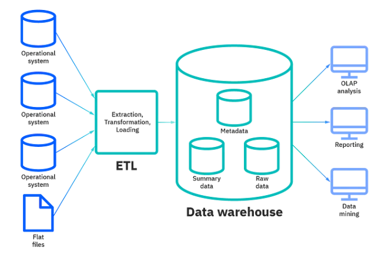

#### A system should be Reliable, Scalable, Maintainable
- **Reliable**: means the system should be fault-tolerant and working when faults/error happen.
- **Scalable**: means should be able to cater to the growing users, traffic and data
- **Maintainable**: even after adding new functionalities and features as per the new requirements, the system and the existing code should work.


#### Load and Load Estimation
The most important three:
- **Throughput** — It's measured by no of jobs processed/ second
- **Response time** — It's measured by the time between sending request and getting a response
- **Latency** — It's measured by the time it takes for a request waiting in the queue to be completed.

```python
import time

class JobProcessor:
    def __init__(self):
        self.queue = []
        self.processed_jobs = 0

    def add_job(self):
        self.queue.append(time.time())

    def process_job(self):
        if self.queue:
            start_time = self.queue.pop(0)
            end_time = time.time()
            response_time = end_time - start_time
            latency = end_time - start_time
            self.processed_jobs += 1
            return response_time, latency
        else:
            return None, None

    def get_throughput(self, elapsed_time):
        return self.processed_jobs / elapsed_time

# Usage example
job_processor = JobProcessor()

# Simulate job arrivals
for _ in range(10):
    job_processor.add_job()
    time.sleep(0.1)

# Process jobs and measure response time and latency
while True:
    response_time, latency = job_processor.process_job()
    if response_time is None:
        break
    print(f"Response Time: {response_time:.3f}s, Latency: {latency:.3f}s")
    time.sleep(0.1)

elapsed_time = time.time()
throughput = job_processor.get_throughput(elapsed_time)
print(f"Throughput: {throughput:.2f} jobs/second")
```

#### NoSQL, SQL and Graph Databases
- **Relational Databases** — It consists of tables ( data organized in rows and columns). It uses joins to fetch data from multiple tables.
- **Non-Relational Databases ( NoSQL databases)** — It consists of keys that are mapped to the values. It’s easier to shard a NoSQL database and works without formatting the data.
- **Graph Databases** — It consists of graph( vertices and edges) and the queries traverse the graph in order to provide the results.


#### Indexes
Indexes are very useful as they help speed up the query execution and helps faster retrieval of the data.

Syntax:
```sql
CREATE INDEX index_name ON table_namme (column_1, column_2, ...column_n);
```
There are two types of indexes —

- Implicit indexes — indexes that are created by databases internally to store, retrieve faster and efficiently.
- Composite indexes — indexes that are created by using multiple columns to uniquely identify the data points.

```sql
-- Syntax
CREATE UNIQUE INDEX index_name ON table_name (column1, column2, ...);
-- Example
CREATE INDEX emp_indx ON employee(emp_name, salary, city);
-- Drop index
ALTER TABLE table DROP INDEX index_name;
```

#### Data Warehousing


- **Row-oriented storage** — Most transactional databases use row oriented storage. The database is partitioned horizontally and with this approach writes are performed easily as compared to reads. Examples — PostgresSQL, MySQL and SQL Server.
```sql
-- Create a table for row-oriented storage
CREATE TABLE row_storage (
    id INT,
    name VARCHAR(50),
    age INT,
    email VARCHAR(100)
);
```
- **Column-oriented storage** — In this every value is stored in the columns contiguously. The database is partitioned vertically and with this approach reads are performed easily as compared to writes. Examples — Redshift, BigQuery and Snowflake.
```sql
-- Create a table for column-oriented storage
CREATE TABLE column_storage (
    id INT[],
    name VARCHAR(50)[],
    age INT[],
    email VARCHAR(100)[]
);
```

- **Data Cube** — It is a process of collecting, storing and managing data from different sources to provide meaningful insights. It is used for reporting and analysis of data.


#### Serialization and Deserialization


#### Replication and Sharding


